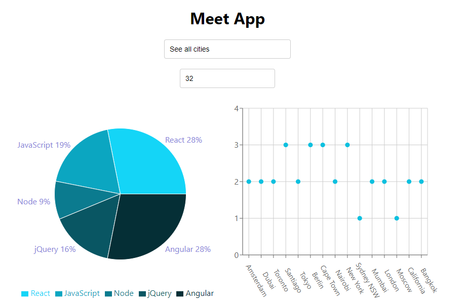

## How Was This App Made?
  This is a progressive web-application (PWA) built through test-driven development via Jest and Asastus.

  React components were mainly utilized and Recharts acted as a major dependency in showing data through pie-charts and scatterplots. It's deployed through gh-pages here: https://henryn05.github.io/meet/
## What Does This App Do?
  Upon opening the PWA, users will be prompted login via a 3rd party authorization server (Google OAuth).

  After logging in, the user can search for events in specific cities and/or change the number of events showing from the output.

  The pie chart and scatterplot will reflect composition of the data based on the user's input.
  

### Scenario 1: Filter Events by City
  Given the user is on the main page
  When they apply a filter to show events in "New York"
  Then the app should display only events happening in New York

### Scenario 2: Show/Hide Event Details
  Given the user is on the event details page
  When they click the "Show Details" button
  Then the event details should be visible

  Given the user is on the event details page
  When they click the "Hide Details" button
  Then the event details should be hidden

### Scenario 3: Specify Number of Events
  Given the user is on the main page
  When they specify the number of events as 5
  Then the app should display 5 events

### Scenario 4: Use the App When Offline
  Given the app is installed on the device
  When the device is offline
  Then the user should still be able to access previously loaded events

### Scenario 5: Add an App Shortcut to the Home Screen
  Given the app is installed on the device
  When the user adds a shortcut to the home screen
  Then they should see the app icon on the home screen

### Scenario 6: Display Charts Visualizing Event Details
  Given the user is on the event details page
  When they choose to view charts
  Then the app should display visual charts representing event details
